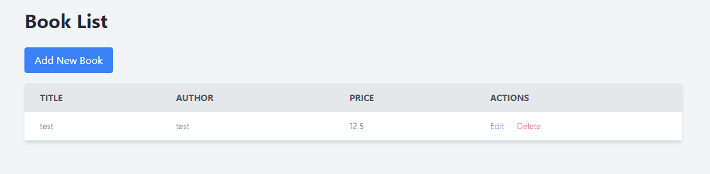
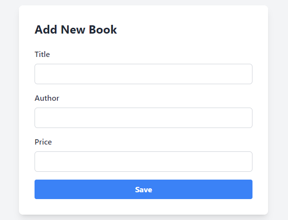
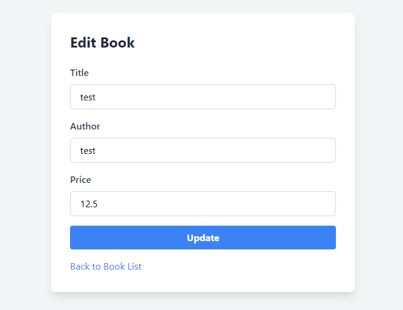

# Book Store CRUD Application

This is a simple **Book Store** application built using **Spring Boot**, **Spring Data JPA**, **Thymeleaf**, and **MySQL**. The application allows users to perform **CRUD** operations (Create, Read, Update, and Delete) on books.

## Features

- **Add new books** to the store.
- **View all books** in the store.
- **Update book details** such as title, author, and price.
- **Delete books** from the store.

## Tech Stack

- **Backend**: Spring Boot, Spring Data JPA, MySQL
- **Frontend**: Thymeleaf
- **Database**: MySQL

## Prerequisites

- **Java 17** or later
- **MySQL** (or any relational database)
- **Maven** (to build the project)

## Getting Started

### 1. Clone the Repository

```bash
git clone https://github.com/your-username/book-store-crud.git
cd book-store-crud
```
### 2. Setup MySQL Database
Create a MySQL database named book_store:
```bash
CREATE DATABASE book_store;
```
### 3. Configure Database Connection
In the src/main/resources/application.properties file, set your MySQL credentials:

properties
```bash
spring.datasource.url=jdbc:mysql://localhost:3306/book_store
spring.datasource.username=your-username
spring.datasource.password=your-password
spring.jpa.hibernate.ddl-auto=update
spring.jpa.show-sql=true
```
### 4. Build and Run the Application
Build the application using Maven and start the Spring Boot server:
```bash
./mvnw spring-boot:run
```

### 5. Access the Application
Once the application is running, open your browser and navigate to:

http://localhost:8080
Application Structure
```bash
src
├── main
│   ├── java
│   │   └── com.example.bookstore
│   │       ├── controller      # Handles HTTP requests and maps them to views
│   │       ├── model           # Contains the Book entity
│   │       ├── repository      # Data access layer (JPA repositories)
│   │       └── service         # Business logic for managing books
│   └── resources
│       ├── templates           # Thymeleaf HTML templates
│       └── application.properties  # Configuration file
```
### Key Files
- **Book.java:** Entity class representing a book with attributes id, title, author, and price.
BookRepository.java: Spring Data JPA repository for managing book data.
BookService.java: Contains the business logic for CRUD operations on books.
BookController.java: Handles HTTP requests and renders the appropriate views.
### Thymeleaf Templates:
- **index.html:** Displays the list of books and allows for edit and delete actions.
- **new_book.html:** Form for adding a new book.
- **update_book.html:** Form for editing an existing book.
## Screenshots

### 1. Book List Page


### 2. Add New Book Page


### 3. Edit Book Page

## CRUD Operations
### 1. Add a New Book
- Navigate to the home page.
- Click on Add New Book.
- Fill in the book details (title, author, price) and click Save.
### 2. View All Books
- The home page lists all available books.
- You can view the book's title, author, and price.
### 3. Update a Book
- From the home page, click Edit next to any book.
- Modify the details and click Update.
### 4. Delete a Book
- From the home page, click Delete next to any book.
- Future Enhancements
- Add user authentication and roles.
- Implement search and pagination for books.
- Add unit and integration tests.
- Improve UI/UX with better styling.